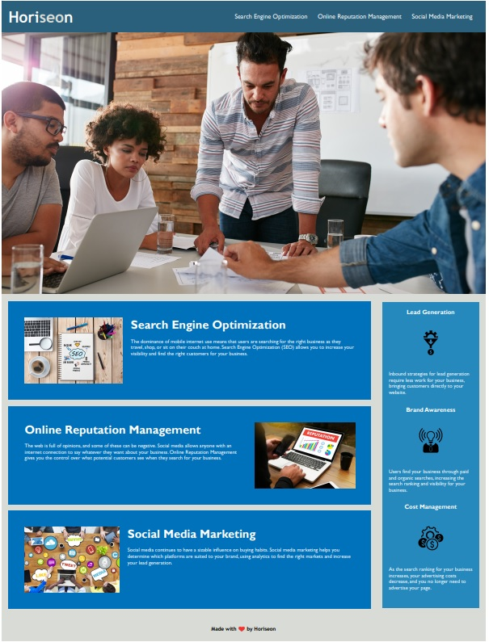

# Horiseon-Accessibility-Standards

## Description

### Project Motivation & Purpose
My motivation for this project is to improve the accessibility standards and to help the marketing agency optimize their site for search engines. This project solves access issues for people who may have a disability that limits how they can interact with the marketing agency's site. Additionally, this project consolidates the CSS selectors and properties while making the overall code less reliant on class selectors by transitioning the HTML to using semantic HTML structure.

### What I Learned Doing This Project
While doing this project, I learned how to transition an HTML document to using semantic structure in a way that keeps the integrity of the HTML without being reliant on the CSS style and positioning elements. Lastly, I learned how to consolidate CSS selectors and properties, clean and update class selectors within HTML, and properly leave comments within my CSS to describe how the styling affects the HTML.

## Installation

N/A

## Usage

You can use the updated Horiseon webpage to review the products and services Horiseon offers and to understand the benefits the products & services can bring your company. The site has been updated to meet accessibility standards for potenial clients with disabilities while maintaining the visual user experience.

Check out the deployed Github Pages application at [https://jeglasper.github.io/Horiseon-Accessibility-Standards/](https://jeglasper.github.io/Horiseon-Accessibility-Standards/).

Check out the application GitHub repository [https://github.com/jeglasper/Horiseon-Accessibility-Standards](https://github.com/jeglasper/Horiseon-Accessibility-Standards).

## Credits

UTSA Bootcamp (2022). 01-HTML-Git-CSS / 02-Challenge / Develop (Version 1) [Source Code]. https://utsa.bootcampcontent.com/utsa-bootcamp/UTSA-VIRT-FSF-PT-01-2023-U-LOLC/-/tree/main/01-HTML-Git-CSS/02-Challenge/Develop 

## License

Please refer to the LICENSE in the repo.